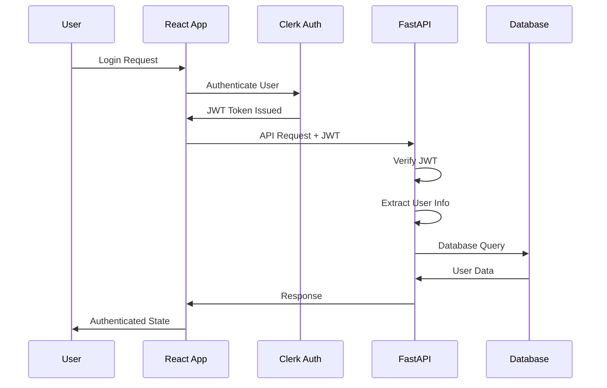
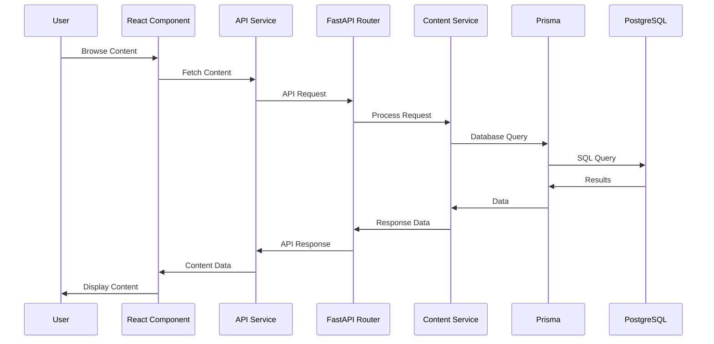
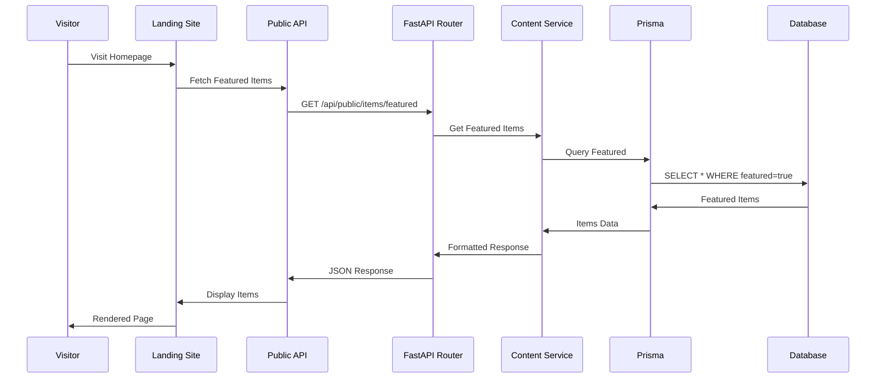
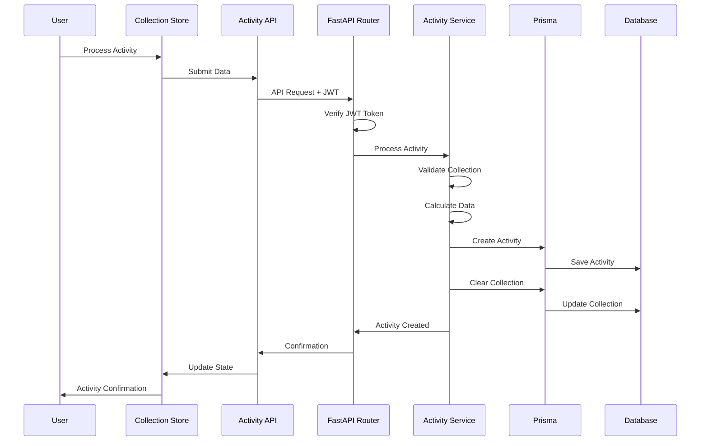
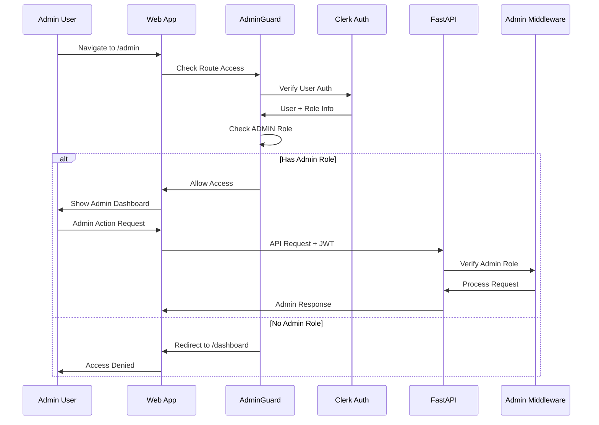
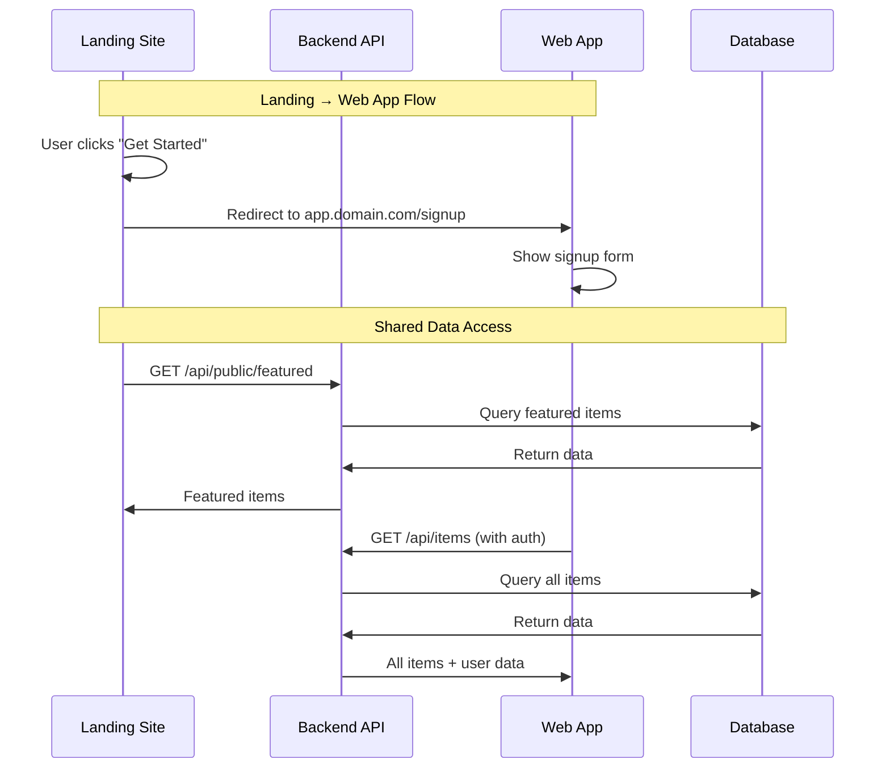
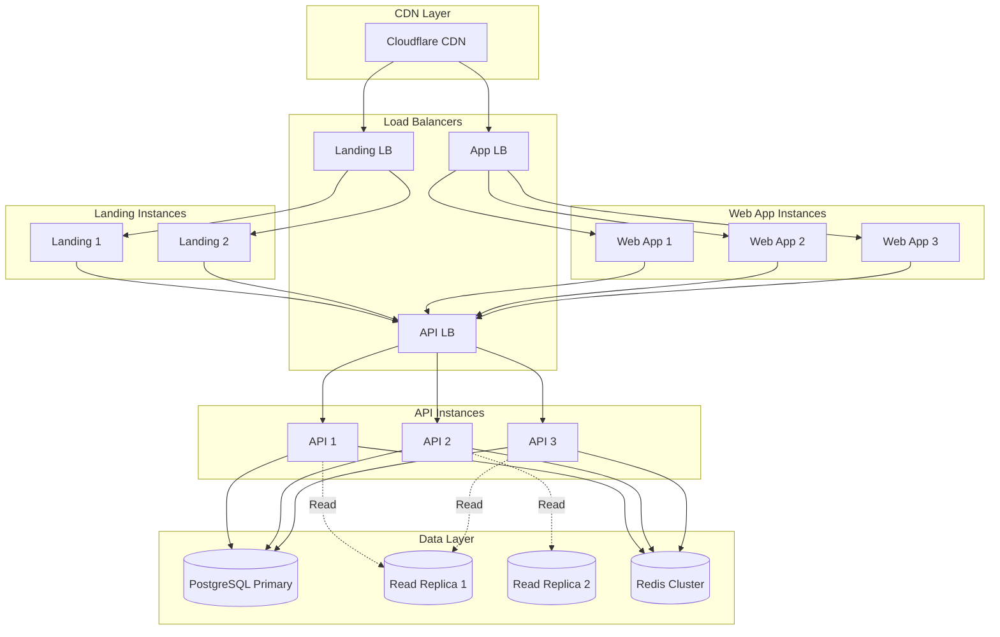

# System Architecture

## Overview
The project follows a modern two-part architecture pattern designed for medium-sized SaaS applications. This architecture completely separates the marketing/landing site from the main application while keeping the admin functionality integrated within the web app. The system uses React with Vite for both frontend applications, organized in a monorepo structure with shared packages, and a unified FastAPI backend that serves both applications.

## High-Level Architecture

```mermaid
graph TB
    subgraph "Public Domain"
        L[Landing Site<br/>example.com<br/>React + Vite<br/>Port: 3000]
    end
    
    subgraph "App Subdomain"
        W[Web Application<br/>app.example.com<br/>React + Vite<br/>Port: 5173]
        AD[Admin Dashboard<br/>app.example.com/admin<br/>Protected Routes]
        W --> AD
    end
    
    subgraph "Shared Packages"
        UI[@project/ui<br/>Shared Components<br/>(shadcn/ui based)]
        UTILS[@project/utils<br/>Common Utilities]
        TYPES[@project/types<br/>TypeScript Types]
    end
    
    subgraph "Backend Services"
        API[FastAPI Backend<br/>app.example.com/api<br/>Port: 5000]
        DB[(PostgreSQL<br/>Port: 5432)]
        R[(Redis Cache<br/>Port: 6379)]
    end
    
    subgraph "External Services"
        CDN[CDN<br/>Static Assets]
        AUTH[Clerk Auth<br/>Authentication]
        S3[Object Storage<br/>User Uploads]
    end
    
    L -->|Public API| API
    W -->|Auth API| API
    AD -->|Admin API| API
    
    L -.->|Import| UI
    L -.->|Import| UTILS
    W -.->|Import| UI
    W -.->|Import| UTILS
    W -.->|Import| TYPES
    
    API --> DB
    API --> R
    
    L -.->|Static Assets| CDN
    W -.->|Authentication| AUTH
    API -.->|File Storage| S3
    
    style L fill:#e1f5fe
    style W fill:#fff3e0
    style AD fill:#ffebee
    style API fill:#f3e5f5
    style UI fill:#e8f5e9
    style UTILS fill:#e8f5e9
    style TYPES fill:#e8f5e9
```

## Detailed Architecture Diagram

```mermaid
graph TB
    subgraph "Monorepo Structure"
        subgraph "apps/landing [Port: 3000]"
            L1[React App]
            L2[Hero Component]
            L3[Features Section]
            L4[Pricing Section]
            L5[Contact Form]
            L1 --> L2
            L1 --> L3
            L1 --> L4
            L1 --> L5
        end
        
        subgraph "apps/web [Port: 5173]"
            W1[React Router]
            W2[User Dashboard]
            W3[Content Management]
            W4[Admin Section]
            W5[Zustand Store]
            W6[Auth Guards]
            W1 --> W2
            W1 --> W3
            W1 --> W4
            W2 --> W5
            W3 --> W5
            W4 --> W5
            W6 --> W4
        end
        
        subgraph "packages/*"
            UI[@project/ui<br/>shadcn/ui Components<br/>Button, Card, Modal, Form]
            UTILS[@project/utils<br/>formatters, validators]
            TYPES[@project/types<br/>User, Item, Activity]
        end
    end
    
    subgraph "API Layer [Port: 5000]"
        B[FastAPI Application]
        B1[Public Routes<br/>/api/public/*]
        B2[Auth Routes<br/>/api/users/*]
        B3[Admin Routes<br/>/api/admin/*]
        B4[Middleware]
        B41[CORS Config]
        B42[JWT Verify]
        B43[Role Check]
        B --> B1
        B --> B2
        B --> B3
        B --> B4
        B4 --> B41
        B4 --> B42
        B4 --> B43
    end
    
    subgraph "Service Layer"
        C[Business Logic]
        C1[Content Service]
        C2[Collection Service]
        C3[Activity Service]
        C4[User Service]
        C5[Admin Service]
        C6[Email Service]
        C --> C1
        C --> C2
        C --> C3
        C --> C4
        C --> C5
        C --> C6
    end
    
    subgraph "Data Layer"
        D[PostgreSQL]
        D1[Users Table]
        D2[Items Table]
        D3[Categories Table]
        D4[Activities Table]
        D5[Collections Table]
        D --> D1
        D --> D2
        D --> D3
        D --> D4
        D --> D5
    end
    
    subgraph "Infrastructure"
        N[Nginx Proxy]
        N1[example.com → :3000]
        N2[app.example.com → :5173]
        N3[*/api → :5000]
        N --> N1
        N --> N2
        N --> N3
    end
    
    L1 -.->|Import| UI
    L1 -.->|Import| UTILS
    W2 -.->|Import| UI
    W3 -.->|Import| UTILS
    W4 -.->|Import| TYPES
    
    L5 -->|POST| B1
    W2 -->|Auth API| B2
    W4 -->|Admin API| B3
    
    B -->|Calls| C
    C -->|Prisma ORM| D
```

## Component Architecture

### Monorepo Structure

```
apps/
├── landing/                 # Marketing site (port 3000)
│   ├── src/
│   │   ├── components/
│   │   │   ├── Hero.tsx           # Hero section
│   │   │   ├── Features.tsx       # Features showcase
│   │   │   ├── Pricing.tsx        # Pricing plans
│   │   │   ├── Testimonials.tsx   # Customer reviews
│   │   │   ├── FAQ.tsx            # Frequently asked questions
│   │   │   └── ContactForm.tsx    # Contact form
│   │   ├── App.tsx                # Main app component
│   │   ├── main.tsx               # Entry point
│   │   └── index.css              # Global styles
│   ├── public/                    # Static assets
│   ├── package.json
│   └── vite.config.ts
│
├── web/                     # Main application (port 5173)
│   ├── src/
│   │   ├── components/
│   │   │   ├── common/            # Shared UI components
│   │   │   ├── layout/            # App layout components
│   │   │   ├── content/           # Content components
│   │   │   ├── collections/       # Collection components
│   │   │   └── admin/             # Admin components
│   │   ├── pages/
│   │   │   ├── dashboard/         # User pages
│   │   │   │   ├── Home.tsx
│   │   │   │   ├── Content.tsx
│   │   │   │   └── Collections.tsx
│   │   │   └── admin/             # Admin pages
│   │   │       ├── Dashboard.tsx
│   │   │       ├── ItemsManagement.tsx
│   │   │       └── UsersManagement.tsx
│   │   ├── guards/                # Route protection
│   │   │   ├── AuthGuard.tsx
│   │   │   └── AdminGuard.tsx
│   │   ├── hooks/                 # Custom hooks
│   │   ├── services/              # API services
│   │   ├── store/                 # Zustand stores
│   │   └── types/                 # TypeScript types
│   ├── package.json
│   └── vite.config.ts
│
└── backend/                 # FastAPI application
    └── [same as before]

packages/
├── ui/                      # Shared UI components (shadcn/ui based)
│   ├── src/
│   │   ├── components/      # shadcn/ui components
│   │   │   ├── ui/         # Base shadcn components
│   │   │   │   ├── button.tsx
│   │   │   │   ├── card.tsx
│   │   │   │   ├── dialog.tsx
│   │   │   │   ├── form.tsx
│   │   │   │   └── ...
│   │   │   └── custom/     # Project-specific components
│   │   │       ├── ItemCard.tsx
│   │   │       ├── CollectionList.tsx
│   │   │       └── ...
│   │   ├── lib/
│   │   │   └── utils.ts    # cn() utility for classes
│   │   └── index.ts
│   └── package.json
├── utils/                   # Shared utilities
│   ├── src/
│   │   ├── formatters.ts
│   │   ├── validators.ts
│   │   └── index.ts
│   └── package.json
└── types/                   # Shared TypeScript types
    ├── src/
    │   ├── models.ts
    │   ├── api.ts
    │   └── index.ts
    └── package.json
```

### Backend (FastAPI)

```
apps/backend/
├── app/
│   ├── api/
│   │   └── v1/
│   │       ├── public/        # Public endpoints (no auth)
│   │       │   ├── __init__.py
│   │       │   ├── items.py      # Public item endpoints
│   │       │   ├── categories.py # Public category endpoints
│   │       │   └── contact.py    # Contact form endpoint
│   │       ├── auth/          # Authenticated endpoints
│   │       │   ├── __init__.py
│   │       │   ├── users.py      # User endpoints
│   │       │   ├── items.py      # Protected item endpoints
│   │       │   ├── collections.py # Collection endpoints
│   │       │   └── activities.py  # Activity endpoints
│   │       └── admin/         # Admin-only endpoints
│   │           ├── __init__.py
│   │           ├── dashboard.py   # Dashboard statistics
│   │           ├── users.py       # User management
│   │           ├── items.py       # Item CRUD
│   │           └── analytics.py   # Analytics data
│   │
│   ├── core/
│   │   ├── config.py         # Settings with environment vars
│   │   ├── security.py       # JWT verification, password utils
│   │   └── deps.py           # Common dependencies
│   │
│   ├── models/               # Pydantic schemas
│   │   ├── public.py         # Public data schemas
│   │   ├── user.py           # User schemas
│   │   ├── item.py           # Item schemas
│   │   ├── collection.py     # Collection schemas
│   │   ├── activity.py       # Activity schemas
│   │   └── admin.py          # Admin-specific schemas
│   │
│   ├── services/             # Business logic
│   │   ├── auth.py           # Auth service (JWT verify)
│   │   ├── item.py           # Item business logic
│   │   ├── collection.py     # Collection logic
│   │   ├── activity.py       # Activity processing
│   │   ├── email.py          # Email notifications
│   │   └── admin.py          # Admin services
│   │
│   ├── middleware/
│   │   ├── cors.py           # CORS configuration
│   │   ├── auth.py           # Auth middleware
│   │   ├── admin.py          # Admin role check
│   │   └── logging.py        # Request/response logging
│   │
│   └── utils/
│       ├── files.py          # File upload handling
│       ├── images.py         # Image optimization
│       └── validators.py     # Custom validators
│
├── prisma/
│   ├── schema.prisma         # Database schema
│   └── migrations/           # Database migrations
│
├── scripts/
│   ├── seed.py               # Seed database
│   └── create_admin.py       # Create admin user
│
├── main.py                   # FastAPI app entry
├── requirements.txt
└── Dockerfile
```

## Data Flow

### 1. Authentication Flow



### 2. Content Browsing Flow



### 3. Landing Site Data Flow



### 4. Activity Processing Flow



### 5. Admin Dashboard Access Flow



### 6. Cross-Application Communication



## Security Architecture

### Authentication & Authorization
- **Clerk (Frontend Only)**: Handles user authentication and UI
- **JWT Verification**: FastAPI validates tokens using JWKS
- **Role-Based Access**: Admin vs User permissions from JWT claims
- **Token Validation**: python-jose with RS256 algorithm
- **Admin Protection**: Additional middleware layer for admin endpoints

### Data Protection
- **HTTPS**: All communications encrypted
- **Input Validation**: Pydantic models validate all inputs
- **SQL Injection Prevention**: Prisma parameterized queries
- **XSS Protection**: React's built-in escaping
- **CORS Configuration**: Restricted origins

### File Upload Security
- **File Type Validation**: Only images allowed
- **Size Limits**: Maximum 5MB per file
- **Filename Sanitization**: Prevent directory traversal
- **Storage Isolation**: Uploads in separate directory

## Performance Optimization

### Frontend Optimization
- **Code Splitting**: Dynamic imports for routes
- **Lazy Loading**: Images and components
- **Caching**: TanStack Query for API responses
- **Bundle Optimization**: Vite tree-shaking
- **Image Optimization**: WebP format, responsive images

### Backend Optimization
- **Async Operations**: FastAPI async endpoints
- **Database Indexing**: Optimized queries
- **Connection Pooling**: Prisma connection management
- **Response Caching**: Redis (future implementation)
- **Static File Serving**: Nginx in production

### Database Optimization
- **Indexed Columns**: Fast lookups
- **Query Optimization**: Efficient JOINs
- **Connection Pooling**: Managed by Prisma
- **Data Pagination**: Limit result sets

## Monorepo Benefits

### Code Sharing with shadcn/ui
```typescript
// packages/ui/src/components/ui/button.tsx
// Base shadcn/ui button component
import * as React from "react"
import { Slot } from "@radix-ui/react-slot"
import { cva, type VariantProps } from "class-variance-authority"
import { cn } from "@/lib/utils"

const buttonVariants = cva(
  "inline-flex items-center justify-center rounded-md text-sm font-medium ring-offset-background transition-colors focus-visible:outline-none focus-visible:ring-2 focus-visible:ring-ring focus-visible:ring-offset-2 disabled:pointer-events-none disabled:opacity-50",
  {
    variants: {
      variant: {
        default: "bg-primary text-primary-foreground hover:bg-primary/90",
        destructive: "bg-destructive text-destructive-foreground hover:bg-destructive/90",
        outline: "border border-input bg-background hover:bg-accent hover:text-accent-foreground",
        secondary: "bg-secondary text-secondary-foreground hover:bg-secondary/80",
        ghost: "hover:bg-accent hover:text-accent-foreground",
        link: "text-primary underline-offset-4 hover:underline",
      },
      size: {
        default: "h-10 px-4 py-2",
        sm: "h-9 rounded-md px-3",
        lg: "h-11 rounded-md px-8",
        icon: "h-10 w-10",
      },
    },
    defaultVariants: {
      variant: "default",
      size: "default",
    },
  }
)

export interface ButtonProps
  extends React.ButtonHTMLAttributes<HTMLButtonElement>,
    VariantProps<typeof buttonVariants> {
  asChild?: boolean
}

const Button = React.forwardRef<HTMLButtonElement, ButtonProps>(
  ({ className, variant, size, asChild = false, ...props }, ref) => {
    const Comp = asChild ? Slot : "button"
    return (
      <Comp
        className={cn(buttonVariants({ variant, size, className }))}
        ref={ref}
        {...props}
      />
    )
  }
)
Button.displayName = "Button"

export { Button, buttonVariants }

// apps/landing/src/components/Hero.tsx
import { Button } from '@project/ui';

// apps/web/src/pages/Dashboard.tsx
import { Button } from '@project/ui';
```

### Type Safety
```typescript
// packages/types/src/models.ts
export interface User {
  id: string;
  email: string;
  role: 'USER' | 'ADMIN';
}

// Shared across all applications
```

### Utility Functions
```typescript
// packages/utils/src/formatters.ts
export const formatCurrency = (amount: number) => {
  return new Intl.NumberFormat('en-US', {
    style: 'currency',
    currency: 'USD'
  }).format(amount);
};
```

## Scalability Considerations

### Application Scaling



### Caching Strategy
- **API Response Cache**: Redis for frequently accessed data
- **Static Assets**: CDN for images and files
- **Database Query Cache**: PostgreSQL query caching
- **Session Storage**: Redis for user sessions

### Future Enhancements

1. **Extract Admin to Separate App**: Move admin dashboard to `apps/admin` when it grows
2. **API Gateway**: Add Kong or similar for advanced routing
3. **Microservices Split**: 
   - Authentication service
   - Notification service
   - Analytics service
4. **Message Queue**: RabbitMQ/Kafka for async operations
5. **Search Service**: Elasticsearch for full-text search
6. **Mobile Apps**: React Native apps in the monorepo
7. **Edge Functions**: Serverless functions for landing site

## Deployment Architecture

### Docker Organization
```
docker/
├── nginx/                  # Nginx configuration
│   ├── nginx.conf         # Main Nginx config
│   └── conf.d/           # Additional configs
├── postgres/             # PostgreSQL configs (optional)
└── volumes/              # Persistent data (git-ignored)
    ├── postgres/        # Database files
    ├── redis/          # Cache data
    ├── pgadmin/        # pgAdmin settings
    └── uploads/        # User uploads
```

### Development Environment
```
Docker Compose (Runtime Only)
├── nginx:alpine          # Reverse proxy & routing
├── postgres:15-alpine    # Database
├── redis:7-alpine       # Cache
├── pgadmin4:latest      # DB management
├── [project]_landing    # Landing site (pre-built)
├── [project]_web        # Web app (pre-built)
└── [project]_backend    # FastAPI app (pre-built)
```

### Nginx Routing Configuration
```nginx
# Landing site
server {
    server_name localhost example.local;
    location / {
        proxy_pass http://landing:3000;
    }
}

# Web application
server {
    server_name app.localhost app.example.local;
    location / {
        proxy_pass http://web:5173;
    }
    location /api {
        proxy_pass http://backend:5000;
    }
}
```

All services use bind mounts for volumes:
- `./docker/volumes/postgres:/var/lib/postgresql/data`
- `./docker/volumes/redis:/data`
- `./docker/volumes/pgadmin:/var/lib/pgadmin`
- `./docker/volumes/uploads:/app/uploads`

### Production Architecture
```
Cloud Infrastructure
├── Domain Management
│   ├── example.com → Landing CDN
│   └── app.example.com → App CDN
├── CDN Layer (CloudFlare)
│   ├── Landing Site Cache
│   └── Web App Cache
├── Origin Servers
│   ├── Landing Site (Vercel/Netlify)
│   ├── Web App (ECS/K8s)
│   └── API Backend (ECS/K8s)
├── Data Layer
│   ├── RDS PostgreSQL (Multi-AZ)
│   ├── ElastiCache Redis
│   └── S3 (File Storage)
└── Monitoring
    ├── CloudWatch/DataDog
    └── Sentry Error Tracking
```

### Deployment Strategy
- **Landing Site**: Deploy to Vercel/Netlify for optimal performance
- **Web Application**: Deploy to AWS ECS or Kubernetes
- **Backend API**: Deploy alongside web app with auto-scaling
- **Database**: Managed PostgreSQL with read replicas
- **Caching**: Redis for session and API response caching

## Monitoring & Logging

### Application Monitoring
- **APM**: DataDog or New Relic
- **Error Tracking**: Sentry
- **Uptime Monitoring**: Pingdom
- **Performance Metrics**: Custom dashboards

### Logging Strategy
- **Structured Logging**: JSON format
- **Centralized Logs**: ELK Stack
- **Log Levels**: DEBUG, INFO, WARNING, ERROR
- **Request Tracing**: Correlation IDs

### Health Checks
```python
@app.get("/health")
async def health_check():
    return {
        "status": "healthy",
        "database": check_database(),
        "storage": check_storage(),
        "external_services": check_external_services()
    }
```