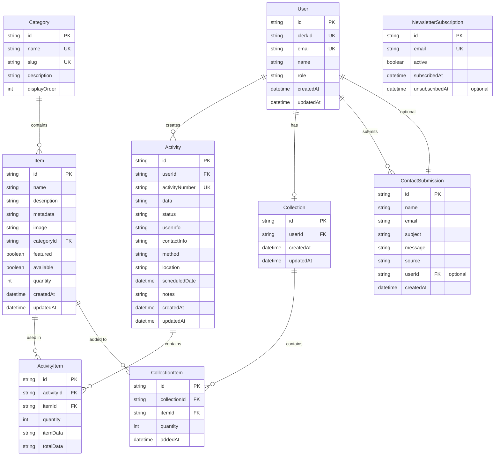

# Database Schema Documentation

## Overview
The project uses PostgreSQL as the primary database with Prisma ORM for type-safe database access. The database serves both the landing site and web application through a unified backend API. This document outlines the complete database schema, relationships, and design decisions.

## Entity Relationship Diagram



## Schema Definition (Prisma)

```prisma
// This is your Prisma schema file
// Learn more about it in the docs: https://pris.ly/d/prisma-schema

generator client {
  provider = "prisma-client-js"
}

datasource db {
  provider = "postgresql"
  url      = env("DATABASE_URL")
}

// User model - integrated with Clerk
model User {
  id        String   @id @default(cuid())
  clerkId   String   @unique // Clerk user ID
  email     String   @unique
  name      String?
  role      Role     @default(CUSTOMER)
  orders    Order[]
  cart      Cart?
  createdAt DateTime @default(now())
  updatedAt DateTime @updatedAt

  @@index([clerkId])
  @@index([email])
}

// Content category
model Category {
  id           String @id @default(cuid())
  name         String @unique
  slug         String @unique
  description  String?
  displayOrder Int    @default(0)
  items        Item[] // Customize: rename based on your domain

  @@index([slug])
}

// Content item model
model Item {
  id             String           @id @default(cuid())
  name           String
  description    String?
  metadata       String? // Customize: use for price, tags, or other domain-specific data
  image          String
  category       Category         @relation(fields: [categoryId], references: [id])
  categoryId     String
  featured       Boolean          @default(false)
  available      Boolean          @default(true) // Customize: rename to inStock, published, etc.
  quantity       Int              @default(0) // Customize: use for stock, views, likes, etc.
  activityItems  ActivityItem[]
  collectionItems CollectionItem[]
  createdAt      DateTime         @default(now())
  updatedAt      DateTime         @updatedAt

  @@index([categoryId])
  @@index([featured])
  @@index([name])
}

// User collection
model Collection {
  id        String           @id @default(cuid())
  user      User             @relation(fields: [userId], references: [id])
  userId    String           @unique
  items     CollectionItem[]
  createdAt DateTime         @default(now())
  updatedAt DateTime         @updatedAt

  @@index([userId])
}

// Collection items
model CollectionItem {
  id           String     @id @default(cuid())
  collection   Collection @relation(fields: [collectionId], references: [id], onDelete: Cascade)
  collectionId String
  item         Item       @relation(fields: [itemId], references: [id])
  itemId       String
  quantity     Int // Customize: use for quantity, priority, rating, etc.
  addedAt      DateTime   @default(now())

  @@unique([collectionId, itemId])
  @@index([collectionId])
  @@index([itemId])
}

// Activity model
model Activity {
  id             String         @id @default(cuid())
  activityNumber String         @unique @default(cuid())
  user           User           @relation(fields: [userId], references: [id])
  userId         String
  items          ActivityItem[]
  data           String? // Customize: use for totals, scores, results, etc.
  status         ActivityStatus @default(PENDING)
  // User information (denormalized for history)
  userInfo       String // Customize: customerName, participantName, etc.
  contactInfo    String // Customize: email, phone, etc.
  // Additional information
  method         ProcessMethod  @default(ONLINE) // Customize: deliveryMethod, accessMethod, etc.
  location       String? // Customize: address, venue, etc.
  scheduledDate  DateTime?
  notes          String?
  createdAt      DateTime       @default(now())
  updatedAt      DateTime       @updatedAt

  @@index([userId])
  @@index([activityNumber])
  @@index([status])
  @@index([createdAt])
}

// Activity items
model ActivityItem {
  id         String   @id @default(cuid())
  activity   Activity @relation(fields: [activityId], references: [id], onDelete: Cascade)
  activityId String
  item       Item     @relation(fields: [itemId], references: [id])
  itemId     String
  quantity   Int
  itemData   String? // Customize: unitPrice, score, rating, etc.
  totalData  String? // Customize: totalPrice, totalScore, etc.

  @@index([activityId])
  @@index([itemId])
}

// Enums
enum Role {
  USER     // Customize: CUSTOMER, MEMBER, STUDENT, etc.
  ADMIN
}

enum ActivityStatus {
  PENDING
  PROCESSING
  READY     // Customize: APPROVED, PUBLISHED, etc.
  COMPLETED
  CANCELLED
}

enum ProcessMethod {
  ONLINE    // Customize: PICKUP, DIGITAL, etc.
  OFFLINE   // Customize: DELIVERY, PHYSICAL, etc.
}

// Landing site specific models
model ContactSubmission {
  id        String   @id @default(cuid())
  name      String
  email     String
  subject   String?
  message   String
  source    String   @default("landing") // landing, web, admin
  // Optional: link to user if they're logged in
  user      User?    @relation(fields: [userId], references: [id])
  userId    String?
  createdAt DateTime @default(now())
  
  @@index([email])
  @@index([createdAt])
}

model NewsletterSubscription {
  id             String    @id @default(cuid())
  email          String    @unique
  active         Boolean   @default(true)
  subscribedAt   DateTime  @default(now())
  unsubscribedAt DateTime?
  
  @@index([email])
  @@index([active])
}
```

## Table Descriptions

### Core Tables (Shared)

#### Users Table
- **Purpose**: Stores user account information synchronized with Clerk
- **Key Fields**:
  - `clerkId`: Unique identifier from Clerk authentication
  - `role`: Determines access level (USER or ADMIN)
- **Relationships**: One-to-many with Activities, One-to-one with Collection, Optional one-to-many with ContactSubmissions
- **Customization**: Rename USER role based on your domain (CUSTOMER, MEMBER, etc.)
- **Used By**: Web application (authentication required)

#### Categories Table
- **Purpose**: Content categorization
- **Key Fields**:
  - `slug`: URL-friendly identifier
  - `displayOrder`: Controls category display sequence
- **Customization**: Define categories based on your domain ([Type A], [Type B], etc.)
- **Used By**: Both landing site (public display) and web application

#### Items Table
- **Purpose**: Core content information
- **Key Fields**:
  - `metadata`: Flexible field for domain-specific data (price, tags, etc.)
  - `featured`: Boolean flag for homepage display on both sites
  - `quantity`: Multi-purpose field (stock, views, likes, etc.)
- **Relationships**: Many-to-one with Category
- **Customization**: Rename to Products, Posts, Assets, etc. based on your domain
- **Used By**: Both landing site (featured items) and web application (full catalog)

### Web Application Tables

#### Collection & CollectionItems Tables
- **Purpose**: Persistent user selections functionality
- **Design Decision**: Separate collection items for flexibility
- **Unique Constraint**: One item per collection to prevent duplicates
- **Customization**: Use for cart, favorites, playlists, etc.
- **Used By**: Web application only (requires authentication)

#### Activities & ActivityItems Tables
- **Purpose**: Activity management and history
- **Design Decisions**:
  - Denormalized user info for historical accuracy
  - Separate activity items for detailed tracking
  - Activity number generation for easy reference
- **Customization**: Use for orders, bookings, submissions, etc.
- **Used By**: Web application only (requires authentication)

### Landing Site Tables

#### ContactSubmission Table
- **Purpose**: Store contact form submissions from landing site
- **Key Fields**:
  - `source`: Identifies where the submission came from (landing/web/admin)
  - `userId`: Optional link to authenticated user
- **Privacy**: Consider GDPR compliance for storing email/personal data
- **Used By**: Primarily landing site, but can be used by web app

#### NewsletterSubscription Table
- **Purpose**: Manage email newsletter subscriptions
- **Key Fields**:
  - `active`: Boolean for subscription status
  - `unsubscribedAt`: Timestamp for opt-out tracking
- **Compliance**: Must support unsubscribe functionality
- **Used By**: Landing site footer, web app settings

## Indexes

### Performance Indexes

#### Authentication & User Queries
- User: `clerkId`, `email` - Fast authentication lookups
- ContactSubmission: `email`, `createdAt` - Admin dashboard queries
- NewsletterSubscription: `email`, `active` - Newsletter management

#### Content Queries
- Item: `categoryId`, `featured`, `name` - Efficient filtering and search
- Category: `slug` - URL-based lookups

#### Application Queries
- Activity: `userId`, `activityNumber`, `status`, `createdAt` - Quick activity queries
- Collection/ActivityItem: Foreign keys for join operations

## Database Migrations

### Initial Migration
```bash
npx prisma migrate dev --name init
```

### Seed Data Structure
```typescript
// prisma/seed.ts
const categories = [
  { name: '[Type A]', slug: 'type-a', displayOrder: 1 },
  { name: '[Type B]', slug: 'type-b', displayOrder: 2 },
  { name: '[Type C]', slug: 'type-c', displayOrder: 3 },
  { name: '[Type D]', slug: 'type-d', displayOrder: 4 },
  { name: '[Type E]', slug: 'type-e', displayOrder: 5 }
];

const items = [
  {
    name: '[Item Name]',
    description: '[Item description]',
    metadata: '[domain-specific data]', // price, tags, etc.
    categorySlug: 'type-a',
    featured: true,
    quantity: 20 // stock, views, etc.
  },
  // ... more items
];
```

## Data Types and Constraints

### Flexible Fields
- `metadata`, `data`, `itemData`, `totalData`: String fields for domain-specific data (prices, scores, etc.)

### String Length Limits
- Most string fields: VARCHAR(255) default
- Description fields: TEXT for longer content

### Unique Constraints
- User: `clerkId`, `email`
- Category: `name`, `slug`
- Activity: `activityNumber`
- CollectionItem: Composite key `[collectionId, itemId]`

## Database Maintenance

### Regular Tasks
1. **Backup Schedule**: Daily automated backups
2. **Index Optimization**: Monthly ANALYZE operations
3. **Data Archival**: Move completed activities > 2 years to archive

### Performance Monitoring
- Query performance tracking
- Slow query log analysis
- Connection pool monitoring

### Security Considerations
- Row-level security via application layer
- Encrypted connections (SSL/TLS)
- Regular security updates
- Audit logging for sensitive operations

## Data Access Patterns

### Landing Site Queries
```sql
-- Featured items for homepage
SELECT * FROM "Item" 
WHERE featured = true AND available = true
ORDER BY "updatedAt" DESC
LIMIT 6;

-- Categories for navigation
SELECT name, slug, 
  (SELECT COUNT(*) FROM "Item" WHERE "categoryId" = c.id) as item_count
FROM "Category" c
ORDER BY "displayOrder";
```

### Web Application Queries
```sql
-- User's collection with items
SELECT c.*, ci.*, i.*
FROM "Collection" c
JOIN "CollectionItem" ci ON ci."collectionId" = c.id
JOIN "Item" i ON i.id = ci."itemId"
WHERE c."userId" = ?
ORDER BY ci."addedAt" DESC;
```

## Future Considerations

### Potential Enhancements
1. **Landing Site Analytics**: Page views, conversion tracking
2. **A/B Testing Tables**: Store variant performance
3. **Item Variants**: Different options/configurations
4. **Real-time Tracking**: Live status updates
5. **User Reviews**: Rating and feedback system
6. **Blog/Content Tables**: For landing site content marketing
7. **FAQ Management**: Dynamic FAQ content

### Scalability Planning
- Partitioning for activities and contact_submissions by date
- Read replicas for landing site queries
- Materialized views for featured content
- Caching layer (Redis) for public data
- Consider separate analytics database