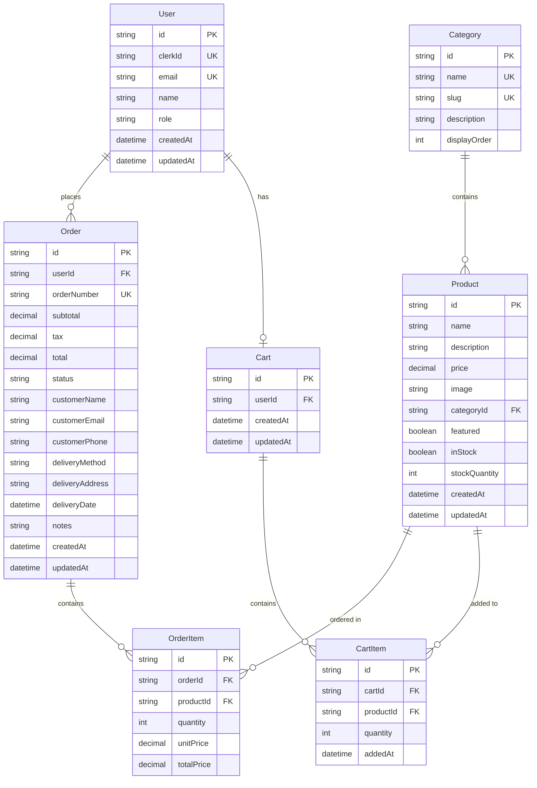

# Database Schema Documentation

## Overview
The Bakery Website uses PostgreSQL as the primary database with Prisma ORM for type-safe database access. This document outlines the complete database schema, relationships, and design decisions.

## Entity Relationship Diagram



## Schema Definition (Prisma)

```prisma
// This is your Prisma schema file
// Learn more about it in the docs: https://pris.ly/d/prisma-schema

generator client {
  provider = "prisma-client-js"
}

datasource db {
  provider = "postgresql"
  url      = env("DATABASE_URL")
}

// User model - integrated with Clerk
model User {
  id        String   @id @default(cuid())
  clerkId   String   @unique // Clerk user ID
  email     String   @unique
  name      String?
  role      Role     @default(CUSTOMER)
  orders    Order[]
  cart      Cart?
  createdAt DateTime @default(now())
  updatedAt DateTime @updatedAt

  @@index([clerkId])
  @@index([email])
}

// Product category
model Category {
  id           String    @id @default(cuid())
  name         String    @unique
  slug         String    @unique
  description  String?
  displayOrder Int       @default(0)
  products     Product[]

  @@index([slug])
}

// Product model
model Product {
  id            String      @id @default(cuid())
  name          String
  description   String?
  price         Decimal     @db.Decimal(10, 2)
  image         String
  category      Category    @relation(fields: [categoryId], references: [id])
  categoryId    String
  featured      Boolean     @default(false)
  inStock       Boolean     @default(true)
  stockQuantity Int         @default(0)
  orderItems    OrderItem[]
  cartItems     CartItem[]
  createdAt     DateTime    @default(now())
  updatedAt     DateTime    @updatedAt

  @@index([categoryId])
  @@index([featured])
  @@index([name])
}

// Shopping cart
model Cart {
  id        String     @id @default(cuid())
  user      User       @relation(fields: [userId], references: [id])
  userId    String     @unique
  items     CartItem[]
  createdAt DateTime   @default(now())
  updatedAt DateTime   @updatedAt

  @@index([userId])
}

// Cart items
model CartItem {
  id        String   @id @default(cuid())
  cart      Cart     @relation(fields: [cartId], references: [id], onDelete: Cascade)
  cartId    String
  product   Product  @relation(fields: [productId], references: [id])
  productId String
  quantity  Int
  addedAt   DateTime @default(now())

  @@unique([cartId, productId])
  @@index([cartId])
  @@index([productId])
}

// Order model
model Order {
  id              String      @id @default(cuid())
  orderNumber     String      @unique @default(cuid())
  user            User        @relation(fields: [userId], references: [id])
  userId          String
  items           OrderItem[]
  subtotal        Decimal     @db.Decimal(10, 2)
  tax             Decimal     @db.Decimal(10, 2)
  total           Decimal     @db.Decimal(10, 2)
  status          OrderStatus @default(PENDING)
  // Customer information (denormalized for order history)
  customerName    String
  customerEmail   String
  customerPhone   String?
  // Delivery information
  deliveryMethod  DeliveryMethod @default(PICKUP)
  deliveryAddress String?
  deliveryDate    DateTime?
  notes           String?
  createdAt       DateTime    @default(now())
  updatedAt       DateTime    @updatedAt

  @@index([userId])
  @@index([orderNumber])
  @@index([status])
  @@index([createdAt])
}

// Order items
model OrderItem {
  id         String  @id @default(cuid())
  order      Order   @relation(fields: [orderId], references: [id], onDelete: Cascade)
  orderId    String
  product    Product @relation(fields: [productId], references: [id])
  productId  String
  quantity   Int
  unitPrice  Decimal @db.Decimal(10, 2)
  totalPrice Decimal @db.Decimal(10, 2)

  @@index([orderId])
  @@index([productId])
}

// Enums
enum Role {
  CUSTOMER
  ADMIN
}

enum OrderStatus {
  PENDING
  PROCESSING
  READY
  COMPLETED
  CANCELLED
}

enum DeliveryMethod {
  PICKUP
  DELIVERY
}
```

## Table Descriptions

### Users Table
- **Purpose**: Stores user account information synchronized with Clerk
- **Key Fields**:
  - `clerkId`: Unique identifier from Clerk authentication
  - `role`: Determines access level (CUSTOMER or ADMIN)
- **Relationships**: One-to-many with Orders, One-to-one with Cart

### Categories Table
- **Purpose**: Product categorization
- **Key Fields**:
  - `slug`: URL-friendly identifier
  - `displayOrder`: Controls category display sequence
- **Initial Categories**: Cake, Muffins, Croissant, Bread, Tart, Favorite

### Products Table
- **Purpose**: Core product information
- **Key Fields**:
  - `price`: Stored as decimal with 2 decimal places
  - `featured`: Boolean flag for homepage display
  - `stockQuantity`: Inventory tracking
- **Relationships**: Many-to-one with Category

### Cart & CartItems Tables
- **Purpose**: Persistent shopping cart functionality
- **Design Decision**: Separate cart items for flexibility
- **Unique Constraint**: One product per cart to prevent duplicates

### Orders & OrderItems Tables
- **Purpose**: Order management and history
- **Design Decisions**:
  - Denormalized customer info for historical accuracy
  - Separate order items for detailed tracking
  - Order number generation for easy reference

## Indexes

### Performance Indexes
- User: `clerkId`, `email` - Fast authentication lookups
- Product: `categoryId`, `featured`, `name` - Efficient filtering and search
- Order: `userId`, `orderNumber`, `status`, `createdAt` - Quick order queries
- Cart/OrderItem: Foreign keys for join operations

## Database Migrations

### Initial Migration
```bash
npx prisma migrate dev --name init
```

### Seed Data Structure
```typescript
// prisma/seed.ts
const categories = [
  { name: 'Cake', slug: 'cake', displayOrder: 1 },
  { name: 'Muffins', slug: 'muffins', displayOrder: 2 },
  { name: 'Croissant', slug: 'croissant', displayOrder: 3 },
  { name: 'Bread', slug: 'bread', displayOrder: 4 },
  { name: 'Tart', slug: 'tart', displayOrder: 5 }
];

const products = [
  {
    name: 'Chocolate Cake',
    description: 'Rich chocolate cake with ganache',
    price: 35.00,
    categorySlug: 'cake',
    featured: true,
    stockQuantity: 20
  },
  // ... more products
];
```

## Data Types and Constraints

### Decimal Fields
- `price`, `subtotal`, `tax`, `total`: DECIMAL(10,2) for accurate monetary calculations

### String Length Limits
- Most string fields: VARCHAR(255) default
- Description fields: TEXT for longer content

### Unique Constraints
- User: `clerkId`, `email`
- Category: `name`, `slug`
- Order: `orderNumber`
- CartItem: Composite key `[cartId, productId]`

## Database Maintenance

### Regular Tasks
1. **Backup Schedule**: Daily automated backups
2. **Index Optimization**: Monthly ANALYZE operations
3. **Data Archival**: Move completed orders > 2 years to archive

### Performance Monitoring
- Query performance tracking
- Slow query log analysis
- Connection pool monitoring

### Security Considerations
- Row-level security via application layer
- Encrypted connections (SSL/TLS)
- Regular security updates
- Audit logging for sensitive operations

## Future Considerations

### Potential Enhancements
1. **Product Variants**: Size/flavor options
2. **Inventory Tracking**: Real-time stock updates
3. **Customer Reviews**: Rating and review system
4. **Loyalty Program**: Points and rewards tracking
5. **Analytics Tables**: Order trends, popular products

### Scalability Planning
- Partitioning for orders table by date
- Read replicas for reporting
- Caching layer (Redis) for frequent queries
- Database sharding if needed